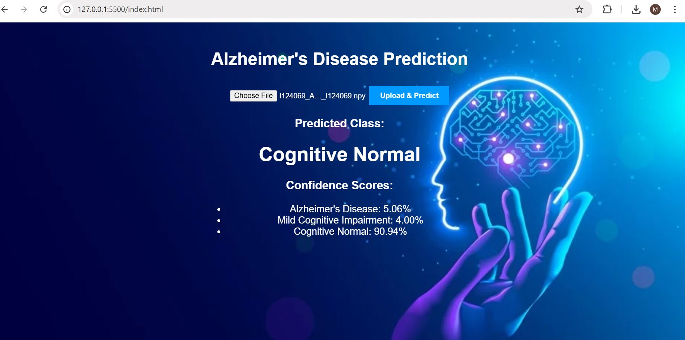

# 🧠 Alzheimer’s Disease Detection Using Deep Learning on 3D MRI

> Final Year Project (2024–25)  
> FAST – National University of Computer & Emerging Sciences, Karachi  

---

## 👨‍💻 Authors

- Muhammad Mubin Farid  
- Syed Hadi Arshad  
- Mir Osama Ali  

**Supervisor:** Dr. Nadeem Kafi  
**Co-Supervisor:** Dr. Nauman Durrani  

---

# 📌 Overview

Alzheimer’s Disease (AD) is a progressive neurodegenerative disorder and the most common cause of dementia worldwide. Early detection — especially at the Mild Cognitive Impairment (MCI) stage — is critical for intervention and disease monitoring.

This project presents a complete deep learning framework that:

- Processes 3D T1-weighted MRI scans  
- Applies a robust tri-level preprocessing pipeline  
- Trains advanced 3D deep learning models  
- Provides clinical interpretability using saliency maps  
- Achieves high classification performance across AD, MCI, and CN  

---

# 🎯 Results

| Metric | Score |
|--------|-------|
| **Test Accuracy** | **92%** |
| **Macro F1-Score** | **0.92** |
| Classes | AD / MCI / CN |

The model demonstrates balanced performance across all diagnostic categories.

---

# 🏗️ Complete System Pipeline

```
Raw MRI (.nii)
      ↓
Tri-Level Preprocessing
      ↓
Processed 3D Volume (.npy)
      ↓
Deep Learning Model
      ↓
Prediction (AD / MCI / CN)
```

---

# 🔬 Tri-Level Preprocessing Pipeline

### 1️⃣ Noise Reduction
- 3D Gaussian filtering (σ = 0.7)
- Improves signal-to-noise ratio (~24%)

### 2️⃣ Skull Stripping
- SynthStrip (Deep Learning U-Net)
- Custom tensor-size handling
- Automatic fallback mechanism

### 3️⃣ Bias Field Correction
- N4 Bias Correction (SimpleITK)
- Optimized parameters for efficiency
- Reduces intensity non-uniformity (~31%)

### Output Formats
- `.nii` — for visualization  
- `.npy` — optimized for deep learning training  

---

# 🧠 Deep Learning Architectures

## 🔹 Model 1 — 3D ResNet-18

- 3D convolutional layers  
- Residual connections  
- Adaptive average pooling  
- Fully connected classifier  
- ~33 million parameters  

---

## 🔹 Model 2 — Enhanced CNN + Vision Transformer (Hybrid)

- 3D CNN backbone with SE attention  
- Patch-based 3D Vision Transformer  
- Multi-head self-attention  
- Feature fusion module  
- ~86 million parameters  

---

# 📊 Training Strategy

### Data Split
- 70% Training  
- 15% Validation  
- 15% Test  

### Optimization
- Optimizer: Adam  
- Learning rate: 1e-4  
- Batch size: 8  
- Weighted Cross-Entropy Loss  
- Early stopping (patience 15)  
- ReduceLROnPlateau scheduler  
- Mixed precision training (FP16)  

---

# 🖥️ Hardware

- GPU: NVIDIA RTX 3090 (24GB VRAM)  
- CUDA 11.8  
- 128GB RAM  
- Intel Xeon CPU  

---

# 📸 Model Output Example

Below is an example prediction output from the trained model:



**Example Result:**

```
Predicted Class: Cognitive Normal

Confidence Scores:
Alzheimer’s Disease: 5.06%
MCI: 4.00%
Cognitive Normal: 90.94%
```

---


# 📊 Dataset

Preprocessed 3D MRI vector dataset available on Kaggle:

Muhammad Mubin Farid. (2026).  
**3D MRI ADNI Vector dataset for Alzheimer Detection** [Data set]. Kaggle.  
https://doi.org/10.34740/KAGGLE/DS/9506069  

---

# 📬 Contact

Muhammad Mubin Farid  
mubinfarid987@gmail.com  

---

# 📜 License

MIT License
